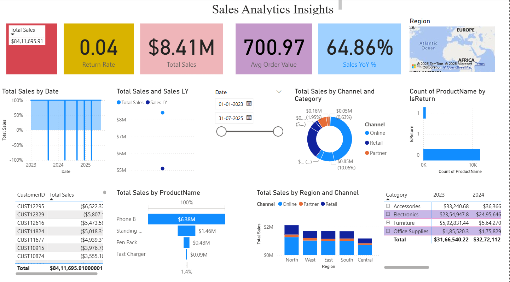

## Strategic Sales Performance Analytics | Data-Driven Growth Strategy 


 

## Problem Statement
The sales leadership team lacks a unified, real-time view of performance across regions, channels, and product categories. This leads to:
- Delayed decision-making due to manual report consolidation.
- Ineffective resource allocation as high-potential products and regions are not clearly identified.
- Inability to proactively address customer churn and return rate issues, directly impacting profitability.

## Solution & Objectives
This interactive Power BI dashboard serves as a single source of truth for the sales organization, designed to:
- **Identify Key Growth Levers:** Pinpoint top-performing products, regions, and customer segments.
- **Diagnose Operational Issues:** Analyze return rates and customer behavior to mitigate revenue loss.
- **Track Performance Trends:** Monitor Year-over-Year (YoY) growth and Average Order Value (AOV).
- **Enable Data-Driven Decisions:** Provide self-service analytics to sales and marketing teams.

## Tools Used
Power BI • SQL • DAX • Excel

## Methodology & Process
**Data Acquisition & Cleaning:** Raw sales data extracted from the SQL database.  
**Data Modeling:** Star-schema with `Fact_Sales` and dimensions (`Date`, `Product`, `Customer`, `Region`).  
**DAX & Measure Engineering:** KPIs like Total Sales LY, YoY Growth, Return Rate, AOV.  
**Interactive Visualization:** Drillable dashboards.  
**Insight Synthesis:** Actionable recommendations for decision-making.

## Results & Business Impact
- ⚠️ **High-Value Customer Concentration Risk:** Top 7 customers contribute ~$36K of $8.41M revenue.  
  **Recommendation:** Key account management + cross-sell program.
- 🚀 **Massive Growth in Electronics:** *Phone B* drives $6.38M (79%) of revenue.  
  **Recommendation:** Promote accessories to lift AOV & LTV.
- 📈 **Strong Performance:** 64.86% YoY growth, AOV $700.97, return rate 0.04%.  
  **Recommendation:** Maintain quality focus; scale campaigns.
- 🌍 **Regional & Channel Analysis:** Re-allocate budgets to high-performing channels in underpenetrated regions.

## Project Links
- [Download Power BI Dashboard (.pbix)](https://drive.google.com/file/d/1O-LpWOa-bEESuPVEQDw6YzVpj3bTBfaR/view?usp=sharing)  
- [View SQL Queries](sql/queries.sql)

## SQL Example
```sql
WITH SalesByYear AS (
    SELECT
        ProductName,
        YEAR(OrderDate) AS OrderYear,
        SUM(SalesAmount) AS TotalSales
    FROM Fact_Sales fs
    JOIN Dim_Product dp ON fs.ProductKey = dp.ProductKey
    GROUP BY ProductName, YEAR(OrderDate)
)
SELECT
    ProductName,
    OrderYear,
    TotalSales,
    LAG(TotalSales) OVER (PARTITION BY ProductName ORDER BY OrderYear) AS SalesLY,
    (TotalSales - LAG(TotalSales) OVER (PARTITION BY ProductName ORDER BY OrderYear)) /
    LAG(TotalSales) OVER (PARTITION BY ProductName ORDER BY OrderYear) * 100 AS YoYGrowth
FROM SalesByYear
ORDER BY ProductName, OrderYear;
